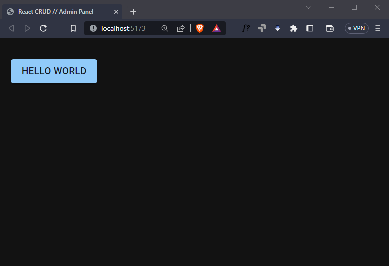
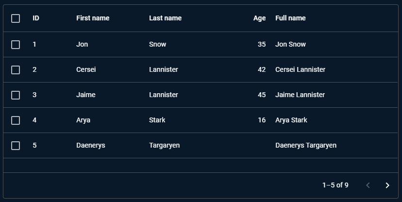
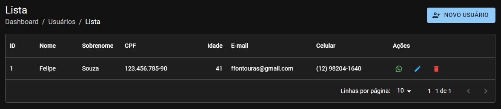
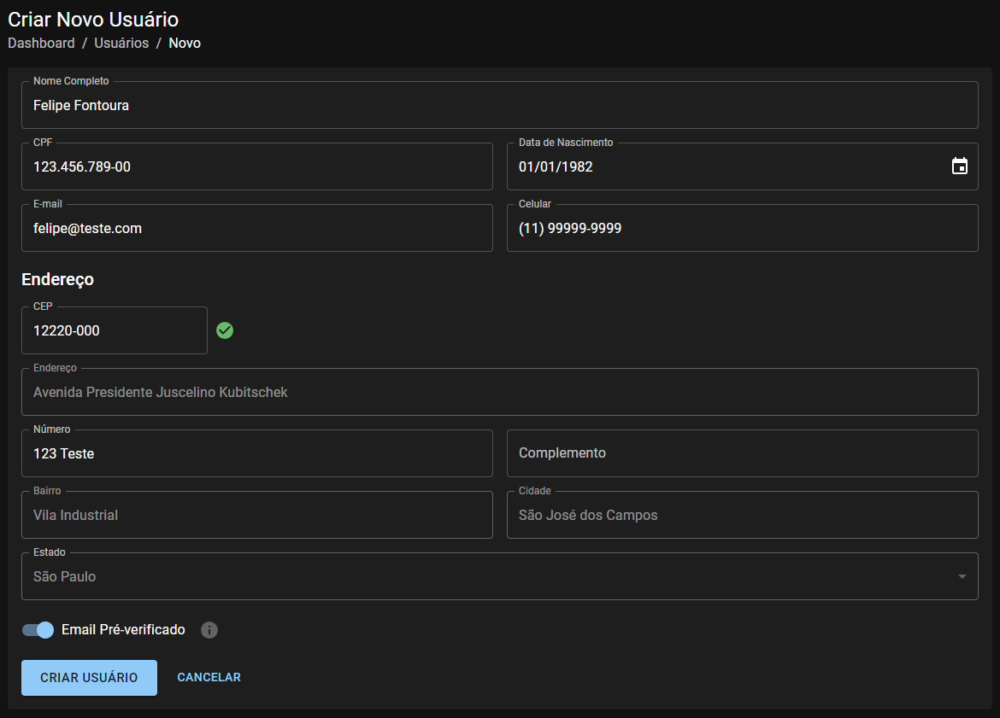

# React CRUD // Admin Panel

Front-end CRUD completo React para sistemas de administração em geral. Ele foi desenvolvido para o conteúdo da [Master Class #014](https://youtube.com/live/mXHkDD9PRM0) da [Dev Samurai](https://devsamurai.com.br).

## Como funciona

Este é um exemplo de como criar um CRUD 'completão' que possuí as principais funções, como: listagem, criação, edição e exclusão de dados.

Sem falar na estrutura de pastas e arquivos que é bem organizada e escalável.

O que ideal para apresentar em um portfólio ou para iniciar um projeto.

## Como executar

Clone, e acesse a pasta do projeto e execute o seguinte comando:

```sh
git clone git@github.com:DevSamurai/react-crud.git
cd react-crud
npm install
npm run dev
```

## Passo a passo

1. [x] Criar o projeto e instalar o Material UI
2. [x] Estrutura de base do CRUD
3. [x] Listagem de usuários
4. [x] Criação de usuários
5. [x] Edição de usuários
6. [x] Leitura de dados na listagem

### Passo 1: Criar o projeto e instalar o Material UI

Para criarmos o projeto iremos utilizar o [Vite](https://vitejs.dev/), que é um bundler extremamente rápido e simples de utilizar. Para instalar o Vite, execute o seguinte comando:

```sh
npm create vite@latest react-crud-admin -- --template react-ts
```

Depois do projeto criado, entre na pasta do projeto e instale o [Material UI](https://mui.com/material-ui/getting-started/installation/):

```sh
cd react-crud-admin
npm install @mui/material @emotion/react @emotion/styled @fontsource/roboto @mui/icons-material @mui/x-data-grid @mui/x-date-pickers date-fns axios
```

Criar o arquivo [`src/theme.ts`](./src/theme.ts):

```ts
import { ptBR as MaterialLocale } from "@mui/material/locale"
import { createTheme } from "@mui/material/styles"
import { ptBR as DataGridLocale } from "@mui/x-data-grid"

export const theme = createTheme(
  {
    palette: {
      mode: "dark",
    },
  },
  DataGridLocale,
  MaterialLocale
)
```

E ajustar o arquivo [`src/main.tsx`](./src/main.tsx):

```tsx
import { Box, Container } from "@mui/material"
import CssBaseline from "@mui/material/CssBaseline"
import { ThemeProvider } from "@mui/material/styles"
import { LocalizationProvider } from "@mui/x-date-pickers"
import { AdapterDateFns } from "@mui/x-date-pickers/AdapterDateFns"
import ptBR from "date-fns/locale/pt-BR"
import React from "react"
import ReactDOM from "react-dom/client"

import { theme } from "./theme.ts"

import App from "./App.tsx"

import "@fontsource/roboto/300.css"
import "@fontsource/roboto/400.css"
import "@fontsource/roboto/500.css"
import "@fontsource/roboto/700.css"

import "./index.css"

ReactDOM.createRoot(document.getElementById("root") as HTMLElement).render(
  <React.StrictMode>
    <ThemeProvider theme={theme}>
      <LocalizationProvider dateAdapter={AdapterDateFns} adapterLocale={ptBR}>
        <CssBaseline />
        <Container maxWidth="lg">
          <Box sx={{ my: 4 }}>
            <App />
          </Box>
        </Container>
      </LocalizationProvider>
    </ThemeProvider>
  </React.StrictMode>
)
```

Nisso já não precisaremos mais dos arquivos e podemos excluí-los:

- `src/App.css`
- `src/index.css`
- `src/assets/logo.svg`
- `src/public/vite.svg`

Ajustar o `title` e remover `favicon` do [`index.html`](./index.html):

```html
<!DOCTYPE html>
<html lang="pt-BR">
  <head>
    <meta charset="UTF-8" />
    <meta name="viewport" content="width=device-width, initial-scale=1.0" />
    <title>React CRUD // Admin Panel</title>
  </head>
  <body>
    <div id="root"></div>
    <script type="module" src="/src/main.tsx"></script>
  </body>
</html>
```

E para que possamos testar se o Material UI está funcionando, vamos adicionar um componente de botão no arquivo [`src/App.tsx`](./src/App.tsx):

```tsx
import { Button } from "@mui/material"

export default function App() {
  return (
    <div>
      <Button variant="contained">Hello World</Button>
    </div>
  )
}
```

E pronto! Já temos algo minimamente funcional:



## Passo 2: Estrutura de base do CRUD

Agora que já fizemos as instalações iniciais, chegou o momento de criar a estrutura de base do nosso CRUD.

Sendo assim, inicie instalando o [React Router](https://reactrouter.com/):

```sh
npm install react-router-dom
```

Crie o arquivo [`src/routes.tsx`](./src/routes.tsx):

```tsx
import { Route, Routes } from "react-router-dom"

import UserCreate from "./pages/Users/Create"
import UserEdit from "./pages/Users/Edit"
import UserList from "./pages/Users/List"

export function AppRoutes() {
  return (
    <Routes>
      <Route path="/users">
        <Route path="/users" element={<UserList />} />
        <Route path="/users/new" element={<UserCreate />} />
        <Route path="/users/:id" element={<UserEdit />} />
      </Route>
    </Routes>
  )
}
```

E ajuste o arquivo [`src/App.tsx`](./src/App.tsx):

```tsx
import { BrowserRouter } from "react-router-dom"

import { AppRoutes } from "./routes"

export default function App() {
  return (
    <BrowserRouter>
      <AppRoutes />
    </BrowserRouter>
  )
}
```

E por fim, vamos criar a pasta [`src/pages/Users`](./src/pages/Users/) e dentro dela vamos criar nas próximas sessões uma estrutura organizada de componentes, sendo eles:

- `pages/Users/List.tsx`: Componente que irá listar os usuários cadastrados.
- `pages/Users/Create.tsx`: Componente que irá criar um novo usuário.
- `pages/Users/Edit.tsx`: Componente que irá editar um usuário existente.
- `pages/Users/components/Form.tsx`: Componente que irá conter o formulário de cadastro e edição de usuários.
- `pages/Users/components/Grid.tsx`: Componente que irá conter a tabela de listagem de usuários.
- `pages/Users/schemas/UserSchema.ts`: Schema de validação do formulário de cadastro e edição de usuários.
- `pages/Users/types/User.ts`: Tipagem do usuário.

Por hora, para cada componente, vamos criar apenas a estrutura mínima para que o React não deixe de funcionar, por exemplo:

```tsx
export default function List() {
  return <>List</>
}
```

E a tipagem de usuário:

```ts
export type User = {
  id: string
  fullName: string
  document: string
  birthDate: Date
  email: string
  emailVerified: boolean
  mobile: string
  zipCode: string
  addressName: string
  number: string
  complement: string
  neighborhood: string
  city: string
  state: string
}
```

## Passo 3: Listagem de usuários

Para criar a listagem de usuários, iremos utilizar o componente `DataTable` do [Material UI](https://mui.com/x/react-data-grid/).



Este é um componente que já entrega as principais funcionalidades de uma listagem, como busca, ordenação, paginação, seleção de linhas, etc.

Ele possui a versão gratuita e a versão paga, sendo que a versão gratuita já atende a maioria dos casos.

E com isso você não precisa criar 'do zero' muitas dessas coisas e pode focar no que realmente importa, que é a lógica de negócio, além de ter um acabamento visual muito interessante.

E para criar o componente [`pages/Users/components/Grid.tsx`](./src/pages/Users/components/Grid.tsx) que irá encapsular o `DataTable`, vamos utilizar o seguinte código:

```tsx
import DeleteIcon from "@mui/icons-material/Delete"
import EditIcon from "@mui/icons-material/Edit"
import WhatsAppIcon from "@mui/icons-material/WhatsApp"
import { IconButton, Stack } from "@mui/material"
import {
  GridColDef,
  GridRenderCellParams,
  GridValueGetterParams,
} from "@mui/x-data-grid"
import { useNavigate } from "react-router-dom"

import DataTable from "../../../components/DataTable"

import { User } from "../types/User"

export default function Grid() {
  const onCall = (params: GridRenderCellParams) => {
    // Chamada via WhatsApp
  }

  const onEdit = (params: GridRenderCellParams) => {
    // Edição de usuário
  }

  const onDelete = (params: GridRenderCellParams) => {
    // Exclusão de usuário
  }

  // Definição das colunas da tabela
  const columns: GridColDef<User>[] = [
    { field: "id", headerName: "ID", width: 70 },
    {
      field: "firstName",
      headerName: "Nome",
      valueGetter: (params: GridValueGetterParams) =>
        `${params.row.fullName.split(" ")?.shift() || ""}`,
    },
    {
      field: "lastName",
      headerName: "Sobrenome",
      valueGetter: (params: GridValueGetterParams) =>
        `${params.row.fullName.split(" ")?.pop() || ""}`,
    },
    { field: "document", headerName: "CPF", width: 150 },
    {
      field: "age",
      headerName: "Idade",
      type: "number",
      valueGetter: (params: GridValueGetterParams) =>
        params.row.birthDate &&
        `${
          new Date().getFullYear() -
          new Date(params.row.birthDate).getFullYear()
        }`,
    },
    { field: "email", headerName: "E-mail", minWidth: 200 },
    { field: "mobile", headerName: "Celular", minWidth: 180 },
    {
      field: "actions",
      headerName: "Ações",
      minWidth: 150,
      sortable: false,
      renderCell: (params) => (
        <Stack direction="row" spacing={2}>
          <IconButton
            color="success"
            size="small"
            onClick={() => onCall(params)}
          >
            <WhatsAppIcon fontSize="inherit" />
          </IconButton>

          <IconButton color="info" size="small" onClick={() => onEdit(params)}>
            <EditIcon fontSize="inherit" />
          </IconButton>

          <IconButton
            color="error"
            size="small"
            onClick={() => onDelete(params)}
          >
            <DeleteIcon fontSize="inherit" />
          </IconButton>
        </Stack>
      ),
    },
  ]

  // Criação de uma carga dummy de usuários
  const users = [
    {
      id: '1',
      fullName: 'Felipe Fontoura',
      document: '986.007.560-30',
      birthDate: new Date(1982, 1, 1),
      email: 'felipe@teste.com.br',
      emailVerified: true,
      mobile: '(11) 99999-9999',
      zipCode: '00000-000',
      addressName: 'Rua Teste',
      number: '123',
      complement: '',
      neighborhood: 'Bairro Teste',
      city: 'São Paulo',
      state: 'SP',
    }
  ]

  return <DataTable columns={columns} rows={users as User[]} />
}
```

E então criar os componentes comuns [`components/PageTitle.tsx`](./src/components/PageTitle.tsx) e [`components/Breadcrumbs.tsx`](./src/components/Breadcrumbs.tsx) na sequência:

```tsx
import { Typography } from "@mui/material"

interface PageTitleProps {
  title: string
}

export default function PageTitle({ title }: PageTitleProps) {
  return (
    <Typography color="text.primary" variant="h5">
      {title}
    </Typography>
  )
}
```

```tsx
import {
  Link,
  Breadcrumbs as MaterialBreadcrumbs,
  Typography,
} from "@mui/material"
import { Link as RouterLink } from "react-router-dom"

interface BreadcrumbProps {
  path: {
    label: string
    to?: string
  }[]
}

export default function Breadcrumbs({ path }: BreadcrumbProps) {
  return (
    <MaterialBreadcrumbs aria-label="breadcrumb">
      <Link underline="hover" color="inherit" component={RouterLink} to="/">
        Dashboard
      </Link>

      {path.map((item, index) =>
        item.to ? (
          <Link
            key={`item-${index}`}
            underline="hover"
            color="inherit"
            component={RouterLink}
            to={item.to || "#"}
          >
            {item.label}
          </Link>
        ) : (
          <Typography key={`item-${index}`} color="text.primary">
            {item.label}
          </Typography>
        )
      )}
    </MaterialBreadcrumbs>
  )
}
```

Depois disso, vamos criar o componente/página [`pages/Users/List.tsx`](./src/pages/Users/List.tsx):

```tsx
import PersonAddAltIcon from "@mui/icons-material/PersonAddAlt"
import { Box, Button, Paper, Stack } from "@mui/material"
import { Link as RouterLink } from "react-router-dom"

import Breadcrumbs from "../../components/Breadcrumbs"
import PageTitle from "../../components/PageTitle"

import Grid from "./components/Grid"

export default function List() {
  return (
    <>
      <Stack direction={{ xs: "column", sm: "row" }} gap={1} mb={2}>
        <Box sx={{ flexGrow: 1 }}>
          <PageTitle title="Lista" />
          <Breadcrumbs
            path={[{ label: "Usuários", to: "/users" }, { label: "Lista" }]}
          />
        </Box>
        <Box sx={{ alignSelf: "center" }}>
          <Button
            component={RouterLink}
            to="/users/new"
            variant="contained"
            startIcon={<PersonAddAltIcon />}
          >
            Novo Usuário
          </Button>
        </Box>
      </Stack>
      <Paper>
        <Grid />
      </Paper>
    </>
  )
}
```

Com este componente criado, basta acessar do navegador o endereço <http://localhost:5173/users/> que poderemos ver a listagem de usuários com os dados de teste.



## Passo 4: Criação de usuários

Para a criação de usuários, iremos utilizar as libs `react-hook-form` e `yup` para validação dos campos, além da lib `react-input-mask` para a criação de máscaras de campos.

Para instalar a lib `react-hook-form` e `yup`, execute o comando:

```sh
npm install react-hook-form @hookform/resolvers yup
```

E a lib `react-input-mask`:

```sh
npm install react-input-mask@3.0.0-alpha.2
npm install -D @types/react-input-mask
```

Com as libs instaladas, vamos criar o [`pages/Users/schemas/UserSchema.tsx`](./src/pages/Users/schemas/UserSchema.ts). Este será o schema de validação dos campos do formulário:

```tsx
import * as yup from "yup"

import { User } from "../types/User"

export const UserSchema = yup
  .object<User>({
    fullName: yup.string().required("Este campo é obrigatório"),
    document: yup.string().required("Este campo é obrigatório"),
    birthDate: yup.date(),
    email: yup
      .string()
      .email("E-mail não reconhecido")
      .required("Este campo é obrigatório"),
    emailVerified: yup.boolean().default(false),
    mobile: yup.string().required("Este campo é obrigatório"),
    zipCode: yup
      .string()
      .required("Este campo é obrigatório")
      .transform((value) => value.replace(/[^\d]+/g, "")),
    addressName: yup.string().required("Este campo é obrigatório"),
    number: yup.string().required("Este campo é obrigatório"),
    complement: yup.string(),
    neighborhood: yup.string().required("Este campo é obrigatório"),
    city: yup.string().required("Este campo é obrigatório"),
    state: yup.string().required("Este campo é obrigatório"),
  })
  .required()
```

E agora, vamos criar o componente [`src/pages/Users/Form.tsx`](./src/pages/Users/components/Form.tsx):

```tsx
import { yupResolver } from "@hookform/resolvers/yup"
import CheckCircleIcon from "@mui/icons-material/CheckCircle"
import InfoIcon from "@mui/icons-material/Info"
import {
  Box,
  Button,
  FormControl,
  FormControlLabel,
  InputLabel,
  MenuItem,
  Select,
  Stack,
  Switch,
  TextField,
  Tooltip,
} from "@mui/material"
import { DatePicker } from "@mui/x-date-pickers"
import { useState } from "react"
import { Controller, useForm } from "react-hook-form"
import InputMask from "react-input-mask"
import { Link as RouterLink, useNavigate, useParams } from "react-router-dom"
import { useLocalStorage } from "usehooks-ts"

import FormTitle from "../../../components/FormTitle"

import { findBrazilianZipCode } from "../../../services/api"

import { UserSchema } from "../schemas/UserSchema"

import { User } from "../types/User"

export default function Form() {
  const [users, setUsers] = useLocalStorage<User[]>("users", [])
  const { id } = useParams()
  const navigate = useNavigate()

  const {
    control,
    register,
    handleSubmit,
    formState: { errors },
    setFocus,
    setValue,
  } = useForm<User>({
    resolver: yupResolver(UserSchema),
  })

  const [zipCodeFounded, setZipCodeFounded] = useState<boolean>()

  const onSubmit = (data: User) => {
    // registra o usuário
    console.log(data)

    navigate("/users/")
  }

  // Função que busca o CEP e preenche os campos de endereço
  const onZipCodeBlur = async (
    event: React.FocusEvent<HTMLInputElement | HTMLTextAreaElement, Element>
  ) => {
    const { value } = event.target

    if (!value) return

    const address = await findBrazilianZipCode(value)

    if (!address || !address?.addressName) {
      setZipCodeFounded(false)

      setValue("addressName", "")
      setValue("neighborhood", "")
      setValue("city", "")
      setValue("state", "")

      setFocus("addressName")

      return
    }

    setZipCodeFounded(true)

    setValue("addressName", address.addressName)
    setValue("neighborhood", address.neighborhood)
    setValue("city", address.city)
    setValue("state", address.state)

    setFocus("number")
  }

  return (
    <Box
      component="form"
      autoComplete="off"
      noValidate
      onSubmit={handleSubmit(onSubmit)}
      sx={{ p: 2 }}
    >
      <TextField
        label="Nome Completo"
        fullWidth={true}
        error={!!errors.fullName}
        helperText={errors.fullName?.message}
        sx={{ marginBottom: 2 }}
        {...register("fullName")}
      />

      <Stack
        direction={{ xs: "column", sm: "row" }}
        spacing={2}
        sx={{ marginBottom: 2 }}
      >
        <Controller
          control={control}
          name="document"
          defaultValue=""
          render={({ field: { ...field } }) => (
            <FormControl fullWidth={true}>
              <InputMask mask="999.999.999-99" {...field}>
                <TextField
                  label="CPF"
                  fullWidth={true}
                  error={!!errors.document}
                  helperText={errors.document?.message}
                />
              </InputMask>
            </FormControl>
          )}
        />

        <Controller
          control={control}
          name="birthDate"
          render={({ field: { ...field } }) => (
            <FormControl fullWidth={true}>
              <DatePicker label="Data de Nascimento" {...field} />
            </FormControl>
          )}
        />
      </Stack>

      <Stack
        direction={{ xs: "column", sm: "row" }}
        spacing={2}
        sx={{ marginBottom: 2 }}
      >
        <TextField
          label="E-mail"
          fullWidth={true}
          error={!!errors.email}
          helperText={errors.email?.message}
          {...register("email")}
        />

        <Controller
          control={control}
          name="mobile"
          defaultValue=""
          render={({ field: { ...field } }) => (
            <FormControl fullWidth={true}>
              <InputMask mask="(99) 99999-9999" {...field}>
                <TextField
                  label="Celular"
                  fullWidth={true}
                  error={!!errors.mobile}
                  helperText={errors.mobile?.message}
                />
              </InputMask>
            </FormControl>
          )}
        />
      </Stack>

      <FormTitle title="Endereço" />

      <Stack
        direction="row"
        alignItems="center"
        spacing={1}
        sx={{ marginBottom: 2, width: 250 }}
      >
        <Controller
          control={control}
          name="zipCode"
          defaultValue=""
          render={({ field: { ...field } }) => (
            <FormControl fullWidth={true} sx={{ width: 220 }}>
              <InputMask
                mask="99999-999"
                ref={field.ref}
                value={field.value}
                onChange={field.onChange}
                onBlur={(e) => {
                  onZipCodeBlur(e)
                  field.onBlur()
                }}
              >
                <TextField
                  label="CEP"
                  fullWidth={true}
                  error={!!errors.zipCode}
                  helperText={
                    errors.zipCode?.message ||
                    (zipCodeFounded === false &&
                      "Não encontrado, favor preencher.")
                  }
                />
              </InputMask>
            </FormControl>
          )}
        />
        {zipCodeFounded === true && <CheckCircleIcon color="success" />}
      </Stack>

      <Controller
        control={control}
        name="addressName"
        defaultValue=""
        render={({ field: { ...field } }) => (
          <FormControl fullWidth={true} sx={{ marginBottom: 2 }}>
            <TextField
              label="Endereço"
              error={!!errors.addressName}
              helperText={errors.addressName?.message}
              disabled={!!zipCodeFounded}
              {...field}
            />
          </FormControl>
        )}
      />

      <Stack
        direction={{ xs: "column", sm: "row" }}
        sx={{ marginBottom: 2 }}
        spacing={2}
      >
        <TextField
          label="Número"
          fullWidth={true}
          error={!!errors.number}
          helperText={errors.number?.message}
          {...register("number")}
        />
        <TextField
          label="Complemento"
          fullWidth={true}
          error={!!errors.complement}
          helperText={errors.complement?.message}
          {...register("complement")}
        />
      </Stack>

      <Stack
        direction={{ xs: "column", sm: "row" }}
        sx={{ marginBottom: 2 }}
        spacing={2}
      >
        <Controller
          control={control}
          name="neighborhood"
          defaultValue=""
          render={({ field: { ...field } }) => (
            <FormControl fullWidth={true}>
              <TextField
                label="Bairro"
                fullWidth={true}
                error={!!errors.neighborhood}
                helperText={errors.neighborhood?.message}
                disabled={!!zipCodeFounded}
                {...field}
              />
            </FormControl>
          )}
        />

        <Controller
          control={control}
          name="city"
          defaultValue=""
          render={({ field: { ...field } }) => (
            <FormControl fullWidth={true}>
              <TextField
                label="Cidade"
                fullWidth={true}
                error={!!errors.city}
                helperText={errors.city?.message}
                disabled={!!zipCodeFounded}
                {...field}
              />
            </FormControl>
          )}
        />
      </Stack>

      <Controller
        control={control}
        name="state"
        defaultValue=""
        render={({ field: { ...field } }) => (
          <FormControl fullWidth={true} sx={{ marginBottom: 2 }}>
            <InputLabel id="state">Estado</InputLabel>
            <Select
              label="Estado"
              labelId="state"
              ref={field.ref}
              name={field.name}
              value={field.value}
              onChange={field.onChange}
              onBlur={field.onBlur}
              disabled={!!zipCodeFounded}
            >
              <MenuItem value={""}></MenuItem>
              <MenuItem value={"AC"}>Acre</MenuItem>
              <MenuItem value={"AL"}>Alagoas</MenuItem>
              <MenuItem value={"AP"}>Amapá</MenuItem>
              <MenuItem value={"AM"}>Amazonas</MenuItem>
              <MenuItem value={"BA"}>Bahia</MenuItem>
              <MenuItem value={"CE"}>Ceará</MenuItem>
              <MenuItem value={"ES"}>Espírito Santo</MenuItem>
              <MenuItem value={"DF"}>Distrito Federal</MenuItem>
              <MenuItem value={"GO"}>Goiás</MenuItem>
              <MenuItem value={"MA"}>Maranhão</MenuItem>
              <MenuItem value={"MT"}>Mato Grosso</MenuItem>
              <MenuItem value={"MS"}>Mato Grosso do Sul</MenuItem>
              <MenuItem value={"MG"}>Minas Gerais</MenuItem>
              <MenuItem value={"PA"}>Pará</MenuItem>
              <MenuItem value={"PB"}>Paraíba</MenuItem>
              <MenuItem value={"PR"}>Paraná</MenuItem>
              <MenuItem value={"PE"}>Pernambuco</MenuItem>
              <MenuItem value={"PI"}>Piauí</MenuItem>
              <MenuItem value={"RJ"}>Rio de Janeiro</MenuItem>
              <MenuItem value={"RN"}>Rio Grande do Norte</MenuItem>
              <MenuItem value={"RS"}>Rio Grande do Sul</MenuItem>
              <MenuItem value={"RO"}>Rondônia</MenuItem>
              <MenuItem value={"RR"}>Roraima</MenuItem>
              <MenuItem value={"SC"}>Santa Catarina</MenuItem>
              <MenuItem value={"SP"}>São Paulo</MenuItem>
              <MenuItem value={"SE"}>Sergipe</MenuItem>
              <MenuItem value={"TO"}>Tocantins</MenuItem>
            </Select>
          </FormControl>
        )}
      />

      <Controller
        control={control}
        name="emailVerified"
        defaultValue={false}
        render={({ field: { onChange, value, ...field } }) => (
          <>
            <FormControlLabel
              control={
                <Switch checked={value} onChange={onChange} {...field} />
              }
              label="Email Pré-verificado"
              sx={{ marginBottom: 2 }}
            />
            <Tooltip title="Cadastrar o usuário sem precisar confirmar seu e-mail.">
              <InfoIcon color="disabled" />
            </Tooltip>
          </>
        )}
      />

      <Stack direction={{ xs: "column", sm: "row" }} spacing={2}>
        <Button type="submit" variant="contained" size="large">
          Criar Usuário
        </Button>
        <Button component={RouterLink} to="/users">
          Cancelar
        </Button>
      </Stack>
    </Box>
  )
}
```

Este é um form bem extenso, conta com validações, máscaras, campos dependentes, etc. Mas o que é importante notar é que ele é bem simples de ser lido e entendido. E isso é possível graças ao React Hook Form e o Material UI.

E como este form, conta com preenchimento automático de CEP, vamos criar a função `findBrazilianZipCode` no arquivo [`services/api.ts`](./src/services/api.ts) que vai nos ajudar com isso:

```tsx
import axios from "axios"

const api = axios.create()

export async function findBrazilianZipCode(zipCode: string): Promise<
  | {
      zipCode: string
      addressName: string
      neighborhood: string
      city: string
      state: string
    }
  | undefined
> {
  try {
    const { data } = await api.get(
      `https://viacep.com.br/ws/${zipCode.replace(/\D/g, "")}/json/`
    )

    return {
      zipCode: data.cep,
      addressName: data.logradouro,
      neighborhood: data.bairro,
      city: data.localidade,
      state: data.uf,
    }
  } catch (error) {
    console.error(error)
    return
  }
}
```

E por fim a página [`pages/Users/Create.tsx`](./src/pages/Users/Create.tsx):

```tsx
import { Paper, Stack } from "@mui/material"

import Breadcrumbs from "../../components/Breadcrumbs"
import PageTitle from "../../components/PageTitle"

import Form from "./components/Form"

export default function Create() {
  return (
    <>
      <Stack sx={{ marginBottom: 2 }}>
        <PageTitle title="Criar Novo Usuário" />
        <Breadcrumbs
          path={[{ label: "Usuários", to: "/users/" }, { label: "Novo" }]}
        />
      </Stack>
      <Paper>
        <Form />
      </Paper>
    </>
  )
}
```

Com isso, basta acessar a página de criação de usuários e testar o preenchimento automático de CEP:



Mas isso não é tudo! Ainda ter que fazer a gravação dos dados, e para isso iremos criar a lib `usehooks-ts` que possui um hook bem interessante para manipulação de dados no `localStorage`:

```sh
npm install usehooks-ts
```

E com isso, vamos ajustar o Form para que ele faça a leitura e gravação:

```tsx
import { useLocalStorage } from "usehooks-ts"

// ...

export default function Form() {
  const [users, setUsers] = useLocalStorage<User[]>("users", []) // monta o hook de leitura e gravação de dados no localStorage
  const { id } = useParams() // carrega o parâmetro de id de rota
  const navigate = useNavigate() // carrega a função de navegação de rota

  useEffect(() => {
    if (!id) return

    // busca o usuário pelo id
    const user = users.find((user) => user.id === id)

    if (!user) return

    // se encontrado, preenche o formulário via setValue do React Hook Form
    setValue("fullName", user.fullName)
    setValue("document", user.document)
    setValue("birthDate", new Date(user.birthDate))
    setValue("email", user.email)
    setValue("emailVerified", user.emailVerified)
    setValue("mobile", user.mobile)
    setValue("zipCode", user.zipCode)
    setValue("addressName", user.addressName)
    setValue("number", user.number)
    setValue("complement", user.complement)
    setValue("neighborhood", user.neighborhood)
    setValue("city", user.city)
    setValue("state", user.state)
  }, [id, setValue, users])

  const onSubmit = (data: User) => {
    // se não tiver id, cria um novo usuário
    if (!id) {
      setUsers([...users, { ...data, id: `${users.length + 1}` }])
    } else {
      // se tiver id, atualiza o usuário
      const newUsers = [...users]
      const userIndex = users.findIndex((user) => user.id === id)
      newUsers[userIndex] = { ...data, id }

      setUsers(newUsers)
    }

    // navega para a página de listagem de usuários
    navigate("/users/")
  }
```

## Passo 5: Edição de usuários

Com a criação, agora iremos reaproveitar o formulário para criar a página de edição de usuários. Para isso, vamos criar a página [`pages/Users/Edit.tsx`](./src/pages/Users/Edit.tsx):

```tsx
import { Paper, Stack } from "@mui/material"

import Breadcrumbs from "../../components/Breadcrumbs"
import PageTitle from "../../components/PageTitle"

import Form from "./components/Form"

export default function Edit() {
  return (
    <>
      <Stack sx={{ marginBottom: 2 }}>
        <PageTitle title="Editar Usuário" />
        <Breadcrumbs
          path={[{ label: "Usuários", to: "/users/" }, { label: "Editar" }]}
        />
      </Stack>
      <Paper>
        <Form />
      </Paper>
    </>
  )
}
```

Como utilizamos o mesmo formulário, e este já está preparado para carregar os dados de um usuário, basta acessar a página de edição de usuários e testar a atualização.

## Passo 6: Leitura de dados na listagem

Como ainda temos o componente de listagem de dados carregando dados `dummy`, vamos ajustar ele para que leia os dados do `localStorage` e também os botões de ação:

```tsx
import DeleteIcon from "@mui/icons-material/Delete"
import EditIcon from "@mui/icons-material/Edit"
import WhatsAppIcon from "@mui/icons-material/WhatsApp"
import { IconButton, Stack } from "@mui/material"
import {
  GridColDef,
  GridRenderCellParams,
  GridValueGetterParams,
} from "@mui/x-data-grid"
import { useNavigate } from "react-router-dom"
import { useLocalStorage } from "usehooks-ts"

import DataTable from "../../../components/DataTable"

import { User } from "../types/User"

export default function Grid() {
  const [users, setUsers] = useLocalStorage<User[]>("users", []) // carrega de localStorage
  const navigate = useNavigate()

  const onCall = (params: GridRenderCellParams) => {
    // se existe o número de telefone, abre o WhatsApp
    if (!params.row.mobile) return

    window.location.href = `https://wa.me/55${params.row.mobile.replace(
      /[^\d]+/g,
      ""
    )}`
  }

  const onEdit = (params: GridRenderCellParams) => {
    // se existe o id, navega para a página de edição
    if (!params.row.id) return
    navigate(`/users/${params.row.id}`)
  }

  const onDelete = (params: GridRenderCellParams) => {
    // se existe o id, remove o usuário
    if (!params.row.id) return
    setUsers(users.filter((user) => user.id !== params.row.id))
  }

  const columns: GridColDef<User>[] = [
    { field: "id", headerName: "ID", width: 70 },
    {
      field: "firstName",
      headerName: "Nome",
      valueGetter: (params: GridValueGetterParams) =>
        `${params.row.fullName.split(" ")?.shift() || ""}`,
    },
    {
      field: "lastName",
      headerName: "Sobrenome",
      valueGetter: (params: GridValueGetterParams) =>
        `${params.row.fullName.split(" ")?.pop() || ""}`,
    },
    { field: "document", headerName: "CPF", width: 150 },
    {
      field: "age",
      headerName: "Idade",
      type: "number",
      valueGetter: (params: GridValueGetterParams) =>
        params.row.birthDate &&
        `${
          new Date().getFullYear() -
          new Date(params.row.birthDate).getFullYear()
        }`,
    },
    { field: "email", headerName: "E-mail", minWidth: 200 },
    { field: "mobile", headerName: "Celular", minWidth: 180 },
    {
      field: "actions",
      headerName: "Ações",
      minWidth: 150,
      sortable: false,
      renderCell: (params) => (
        <Stack direction="row" spacing={2}>
          <IconButton
            color="success"
            size="small"
            onClick={() => onCall(params)}
          >
            <WhatsAppIcon fontSize="inherit" />
          </IconButton>

          <IconButton color="info" size="small" onClick={() => onEdit(params)}>
            <EditIcon fontSize="inherit" />
          </IconButton>

          <IconButton
            color="error"
            size="small"
            onClick={() => onDelete(params)}
          >
            <DeleteIcon fontSize="inherit" />
          </IconButton>
        </Stack>
      ),
    },
  ]

  return <DataTable columns={columns} rows={users as User[]} />
}
```

Com isso, já teremos os dados sendo carregados do `localStorage` e os botões de ação funcionando.

## Conclusão

Com isso, temos um CRUD completo de usuários, com listagem, criação, edição e remoção de usuários. Além disso, temos um formulário com validação e máscaras, e uma listagem com paginação e ordenação.

Claro, que estamos utilizando os dados de localStorage, mas você pode utilizar qualquer API para carregar os dados, basta ajustar o componente de listagem para carregar os dados da API via Axios, por exemplo.

E caso você queira implementar isso, pode utilizar como base a nossa [Master Class #005 - MÍNIMO pra passar - React e Node.js](https://youtu.be/teJ8e5m71QA) disponível no YouTube.

Espero que tenha gostado 🧡

-- Felipe Fontoura, @DevSamurai

PS: Se você curtiu esse conteúdo, vai curtir também minha newsletter, inscreva-se em <https://st.devsamurai.com.br/f7tvr6rx/index.html>

## Referências

Alguns links e referências que podem te ajudar:

- [Template de Dashboard Profissional](https://minimals.cc/dashboard)
- [Material UI + React Hook Form](https://levelup.gitconnected.com/reareact-hook-form-with-mui-examples-a3080b71ec45)
